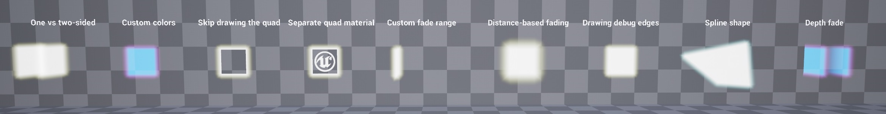

# GlowingQuad

Unreal Engine implementation of the fake volumetric glow / flare effect from Doom 3 (FlareDeform).

Following [the original implementation](https://github.com/TTimo/doom3.gpl/blob/master/neo/renderer/tr_deform.cpp#L509) and [an article](http://web.archive.org/web/20220629163007/http://yzergame.com/doomGlare.html) by Tim Sabo.

This is a pretty cheap way to fake bloom for a single quad. Doesn't require `MobileHDR`, any post processing or fancy materials. This is done by deforming a procedural mesh each frame, drawn with a simple additive or translucent material. Might come in handy for the retro look, low-end mobile devices or for mobile VR.

Tested on UE 4.27.2 with Oculus Quest 2, should work with other engine versions and devices without too much trouble.

Sample project with additional examples: [https://github.com/hollowdilnik/GlowingQuadExamples](https://github.com/hollowdilnik/GlowingQuadExamples)

### You can:
- Draw one- and two-sided quads
- Draw customizable colors
- Optionally skip drawing the inner quad and just draw the glow
- Use a separate material for the inner quad (and access the UVs)
- Customize the fade angle range
- Change the glow size base on the distance from the camera
- Make the glow size ignore actor's scaling and remain in world space units
- Draw a debug wireframe
- Customize the quad shape (ever wanted a glowing trapezoid in your game? I got you!)

### How to use
Refer to the GlowShowcase map in the plugin content folder for examples.

There is now a vertex shader implementation of this technique (see [the blog post](https://hollowdilnik.com/2022/06/20/doom-glow.html) for details).
It requires a special kind of mesh that has specific data baked into it.
Use `/ShaderGlow/SM_GlowingRectangle` for a rectangular glow, or a static mesh generated by `/ShaderGlow/BP_GlowMeshMaker` for any convex planar shape.
To make a custom mesh, define the shape using the spline in an instance of `/ShaderGlow/BP_GlowMeshMaker`, select its procedural mesh and click on `Create StaticMesh`.
The resulting mesh can then be placed in the world or used in instanced static mesh components.
You can put hundreds, if not thousands, glowing meshes in a hierarchical instanced static mesh and enjoy both instancing and culling!

Some additional points to keep in mind:
- All glow-related stuff is tucked away in a material function, so modifying the materials on top of that is easy.
- Per-instance dynamic material parameters will require some additional wiring, but it can be done.
- If you want a single-sided shader-based glow, set the material to be single-sided.
- As with the procedural mesh approach, if you supply different glow and fill materials, it would draw the mesh in two draw calls. If the materials are the same, the sections will be merged and drawn in a single draw call.
- Keep the spline points in the same horizontal plane. If you want to create a spline mesh on a slanted / vertical surface, align the GlowMeshMaker with the surface first.

### TODO:
- Merging multiple quads in a single procedural mesh to reduce draw calls
- Calculate the UV coordinates for the glow mesh
- Make an example implementation of a simple instancing manager for supplying per-instance custom data to the shader
- Automatically determine the plane orientation in glow mesh generation
